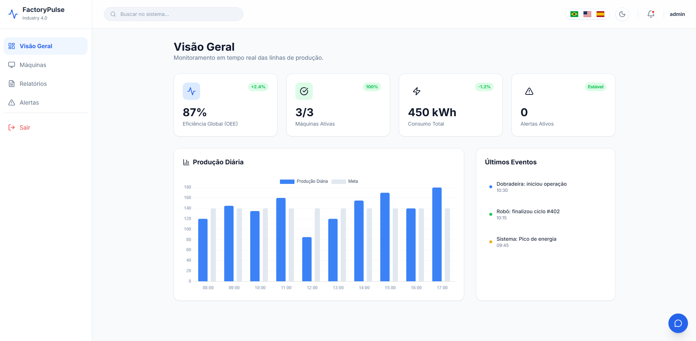
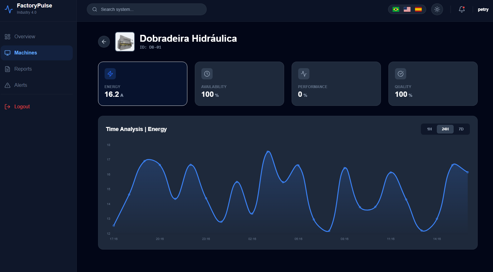
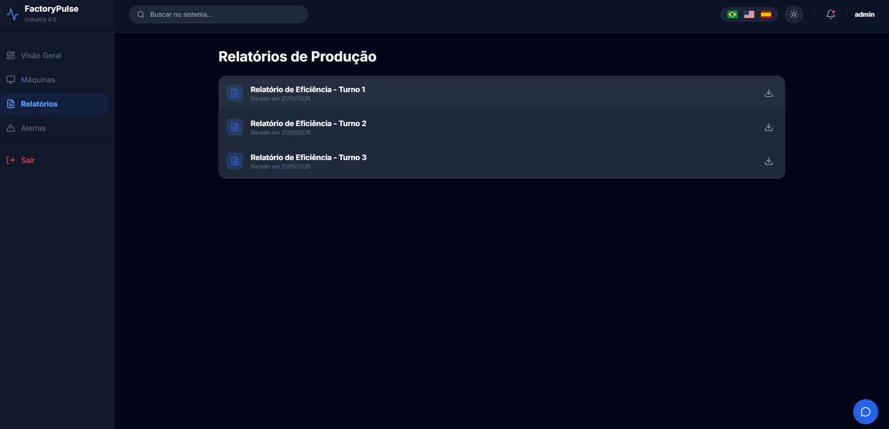
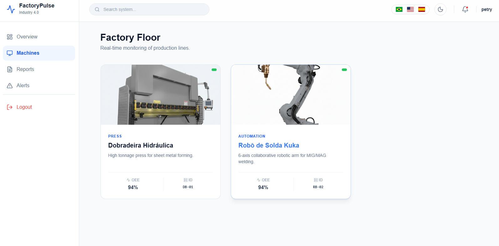
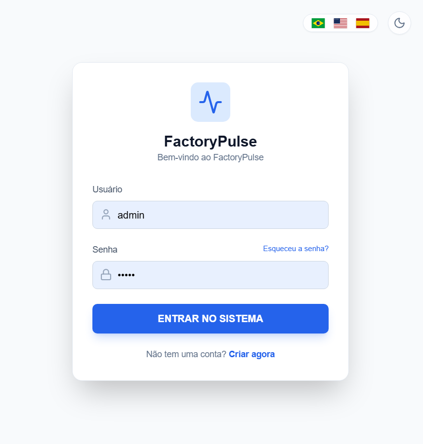

# FactoryPulse - IIoT OEE Analytics Platform


## Project Overview

**FactoryPulse** is a specialized Industrial Internet of Things (IIoT) platform engineered to calculate and visualize **Overall Equipment Effectiveness (OEE)** in real-time.

In modern manufacturing, simply knowing if a machine is "on" or "off" is insufficient. This application solves the visibility gap by processing high-frequency telemetry from the shop floor to quantify exactly how effectively manufacturing equipment is utilized. It transforms raw sensor data into the three critical OEE benchmarks:

1.  **Availability:** Tracking unplanned downtime and stop events.
2.  **Performance:** Measuring actual production speed against ideal cycle times.
3.  **Quality:** Monitoring the ratio of good parts versus scrap/defects.

### The IIoT Ecosystem

This project serves as the cloud/server infrastructure for the **Open IoT Gateway Firmware**, a custom C++ embedded solution for ESP32 microcontrollers. Together, they form a complete end-to-end Industry 4.0 solution:

* **Edge Layer (Data Collection):** [Open-IoT-Gateway-Firmware](https://github.com/petry-dev/Open-IoT-Gateway-Firmware) - Handles signal acquisition, protocol translation, and MQTT publishing.
* **Server Layer (Data Processing):** **FactoryPulse** (This Repository) - Handles data ingestion, complex OEE logic, persistent storage, and visualization.

---

## Application Gallery

### 1. Operational Dashboard (The OEE Hub)
The central command center designed for plant managers. It aggregates data from all active lines to present a global OEE percentage, total energy consumption, and real-time production throughput against daily targets.



### 2. Deep Telemetry Analysis
A granular view for maintenance engineers. This module correlates OEE losses with physical telemetry. It renders real-time amperage charts to help diagnose if performance drops are due to mechanical stress or operator delay. Shown here in **Dark Mode**.



### 3. Production Reports
A historical log interface allowing management to audit past production shifts, export efficiency metrics, and analyze long-term downtime trends.



### 4. Asset Registry
A centralized catalog of all provisioned industrial assets (Robotic Arms, CNC Centers, Hydraulic Presses), displaying real-time connection status.



### 5. Secure Authentication
Enterprise-grade login interface utilizing JWT (JSON Web Tokens) for secure, stateless session management.



---

## System Architecture

The solution implements a scalable **Event-Driven Architecture** fully orchestrated via Docker:

1.  **Data Acquisition:** The Edge Firmware publishes events (Cycle Complete, Scrap Detected, Machine Error) and telemetry (Amperage) to the **Mosquitto Broker** (Containerized).
2.  **Ingestion Middleware:** A Python-based worker subscribes to `industry/+/io`. It performs edge detection on digital signals to distinguish between a valid production cycle and a false positive before writing to the database.
3.  **Backend Core (Django):** Acts as the single source of truth. It manages the relational model between Machines, Production Events, and Sensor Readings.
4.  **Database (PostgreSQL):** Robust relational storage replacing SQLite for production-grade data integrity and concurrency.
5.  **Frontend (React):** Consumes the API via Docker networking. It polls for fresh data to ensure operators see the machine state with sub-second latency.

---

## Technical Stack

### Infrastructure & DevOps
* **Containerization:** Docker & Docker Compose (Full Stack Isolation).
* **Database:** PostgreSQL 15 (Alpine).
* **Message Broker:** Eclipse Mosquitto (MQTT).

### Backend
* **Framework:** Django 6.0 & Django REST Framework (DRF).
* **Runtime:** Python 3.12 (Slim Image).
* **Messaging:** Paho MQTT Client.
* **Authentication:** SimpleJWT (Stateless Token Authentication).

### Frontend
* **Core:** React.js (Vite Ecosystem).
* **Runtime:** Node.js 22 (Alpine).
* **Styling:** Tailwind CSS (Utility-first framework).
* **Visualization:** Chart.js & react-chartjs-2.
* **Internationalization:** i18n support.

---

## Installation & Setup Guide

The entire project is containerized. You do not need to install Python, Node, or PostgreSQL locally. You only need **Docker Desktop**.

### Prerequisites
* [Docker Desktop](https://www.docker.com/products/docker-desktop/) installed and running.

### 1. Initial Configuration

Clone the repository and create the environment file:

```bash
git clone [https://github.com/petry-dev/FactoryPulse.git](https://github.com/petry-dev/FactoryPulse.git)
cd FactoryPulse
```
# Create .env file (Windows/Linux)
# Ensure your .env contains DB_NAME, DB_USER, DB_PASSWORD settings as per docker-compose.yml

### 2. Start the Stack
Run the following command to build and start the Backend, Frontend, Database, and Broker:

```bash
docker-compose up --build
```
Wait until the logs show that the database is ready and the Django server is listening.

### 3. Database Setup (First Run Only)
Open a new terminal window and execute the migrations inside the running container:
```bash
# Apply database migrations to PostgreSQL
docker-compose exec backend python manage.py migrate

# Create a Superuser for the Admin Panel
docker-compose exec backend python manage.py createsuperuser

# (Optional) Seed the database with simulation data
docker-compose exec backend python manage.py seed_data
```

### 4. Start MQTT Ingestion Worker
```bash
docker-compose exec backend python manage.py run_mqtt
```
## Accessing the Application

- **Frontend (Dashboard):** http://localhost:5173  
- **Backend API:** http://localhost:8000/api/  
- **Admin Panel:** http://localhost:8000/admin/  
- **MQTT Broker:** `localhost:1883`

## API Documentation

The backend exposes a RESTful API for integration:

- **POST** `/api/token/`  
  Authenticate and retrieve Access/Refresh tokens.

- **GET** `/api/machines/`  
  Retrieve a list of assets with their current OEE snapshot.

- **GET** `/api/machines/{device_id}/`  
  Retrieve detailed timeseries data (Amps) and event logs for a specific machine.

## License

This project is open-source and available under the [MIT License](LICENSE).