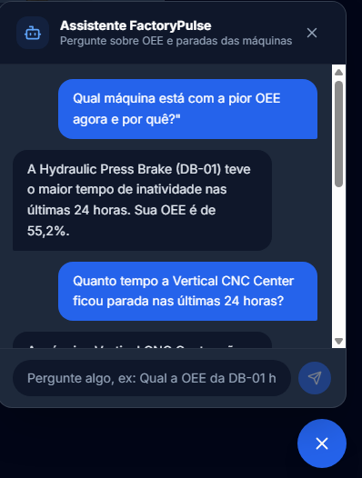

# FactoryPulse - IIoT OEE Analytics Platform


## Project Overview

**FactoryPulse** is a specialized Industrial Internet of Things (IIoT) platform engineered to calculate and visualize **Overall Equipment Effectiveness (OEE)** in real-time.

In modern manufacturing, simply knowing if a machine is "on" or "off" is insufficient. This application solves the visibility gap by processing high-frequency telemetry from the shop floor to quantify exactly how effectively manufacturing equipment is utilized. It transforms raw sensor data into the three critical OEE benchmarks:

1.  **Availability:** Tracking unplanned downtime and stop events.
2.  **Performance:** Measuring actual production speed against ideal cycle times.
3.  **Quality:** Monitoring the ratio of good parts versus scrap/defects.

On top of the dashboards, FactoryPulse also exposes its analytics to language
models: a plant manager can simply ask *"What's DB-01's OEE this week?"* and
get a grounded answer, either through Claude Desktop (via MCP) or the in-app
chat assistant. See [AI Layer: Conversational Assistant & MCP Integration](#ai-layer-conversational-assistant--mcp-integration)
for how that's built.

### The IIoT Ecosystem

This project serves as the cloud/server infrastructure for the **Open IoT Gateway Firmware**, a custom C++ embedded solution for ESP32 microcontrollers. Together, they form a complete end-to-end Industry 4.0 solution:

* **Edge Layer (Data Collection):** [Open-IoT-Gateway-Firmware](https://github.com/petry-dev/Open-IoT-Gateway-Firmware) - Handles signal acquisition, protocol translation, and MQTT publishing.
* **Server Layer (Data Processing):** **FactoryPulse** (This Repository) - Handles data ingestion, complex OEE logic, persistent storage, asynchronous background tasks, and visualization.

---

## Application Gallery

### 1. Operational Dashboard (The OEE Hub)
The central command center designed for plant managers. It aggregates data from all active lines to present a global OEE percentage, total energy consumption, and real-time production throughput against daily targets.


### 2. Deep Telemetry Analysis
A granular view for maintenance engineers. This module correlates OEE losses with physical telemetry. It renders real-time amperage charts to help diagnose if performance drops are due to mechanical stress or operator delay. Shown here in **Dark Mode**.


### 3. Production Reports
A historical log interface allowing management to audit past production shifts, export efficiency metrics, and analyze long-term downtime trends.


### 4. Asset Registry
A centralized catalog of all provisioned industrial assets (Robotic Arms, CNC Centers, Hydraulic Presses), displaying real-time connection status.


### 5. AI Assistant Chat
A conversational layer on top of the analytics API. Operators can ask plain-language questions about machine OEE and downtime — *"Which machine has the worst OEE right now and why?"* — and get grounded, tool-backed answers in real time.



### 6. Secure Authentication
Enterprise-grade login interface utilizing JWT (JSON Web Tokens) for secure, stateless session management.


---

## System Architecture

The solution implements a scalable **Event-Driven Architecture** fully orchestrated via Docker:

1.  **Data Acquisition:** The Edge Firmware publishes events (Cycle Complete, Scrap Detected, Machine Error) and telemetry (Amperage) to the **Mosquitto Broker** (Containerized).
2.  **Ingestion Middleware:** A Python-based worker subscribes to `industry/+/io`. It performs edge detection on digital signals to distinguish between a valid production cycle and a false positive before writing to the database.
3.  **Backend Core (Django):** Acts as the single source of truth. It manages the relational model between Machines, Production Events, and Sensor Readings.
4.  **Asynchronous Processing (Celery & Redis):** Offloads heavy OEE aggregations, report generation, and time-consuming logic to background workers, ensuring the main API remains highly responsive. Redis acts as both the message broker and the result backend.
5.  **Database (PostgreSQL):** Robust relational storage replacing SQLite for production-grade data integrity and concurrency.
6.  **Frontend (React):** Consumes the API via Docker networking. It polls for fresh data to ensure operators see the machine state with sub-second latency.
7.  **AI Layer (Conversational Access):** A dedicated read-only service account exposes the OEE/downtime analytics to language models through two complementary integrations that share one authenticated API client — an MCP server for MCP-compatible clients (Claude Desktop, the MCP Inspector) and an agentic FastAPI service that runs Claude's tool-use loop behind a `/ask` endpoint, surfaced in the React app as a chat widget. Detailed below.

---

## Technical Stack

### Infrastructure & DevOps
* **Containerization:** Docker & Docker Compose (Full Stack Isolation).
* **Database:** PostgreSQL 15 (Alpine).
* **Message Broker (IoT):** Eclipse Mosquitto (MQTT).
* **Message Broker (Tasks):** Redis 7 (Alpine).
* **Task Monitoring:** Celery Flower.

### Backend
* **Framework:** Django 6.0 & Django REST Framework (DRF).
* **Runtime:** Python 3.12 (Slim Image).
* **Messaging:** Paho MQTT Client.
* **Task Queue:** Celery 5.3.
* **Authentication:** SimpleJWT (Stateless Token Authentication).

### Frontend
* **Core:** React.js (Vite Ecosystem).
* **Runtime:** Node.js 22 (Alpine).
* **Styling:** Tailwind CSS (Utility-first framework).
* **Visualization:** Chart.js & react-chartjs-2.
* **State (Assistant Chat):** Zustand.
* **Internationalization:** i18n support.

### AI / Agents
* **LLM Integration:** Anthropic Claude — tool use / function calling, run in an agentic loop.
* **Protocol:** Model Context Protocol (MCP) via the official Python SDK (`mcp[cli]` / FastMCP).
* **Agent Service:** FastAPI (async, Pydantic models, dependency injection, CORS).
* **Shared Integration Layer:** a single authenticated `httpx` client (`factorypulse_mcp.client.FactoryPulseClient`) reused by both the MCP server and the agent service.

---

## AI Layer: Conversational Assistant & MCP Integration

Dashboards are great for spotting trends, but sometimes the fastest way to get
an answer is just to ask for it — *"What's DB-01's OEE this week?"*, *"Which
machine lost the most time to stoppages today?"*. FactoryPulse answers those
questions by combining four pieces, each with a single, well-defined
responsibility:

1. **Read-only analytics endpoints** (`factory-pulse-backend`). The OEE and
   downtime calculations that used to live inline in the views were extracted
   into `core/analytics.py` — a small, dependency-free module covering period
   parsing, OEE breakdown, stoppage pairing and downtime ranking — and exposed
   through `GET /machines/<id>/oee/`, `GET /machines/<id>/downtime/` and
   `GET /downtime/top/`, all accepting a rolling `period` query parameter
   (`30m`, `24h`, `7d`, ...). A `create_service_token` management command
   provisions a dedicated, long-lived, **read-only** account — no staff or
   admin rights — and issues it a JWT, so external integrations authenticate
   exactly like the React frontend does (`Authorization: Bearer <token>`)
   without ever touching write endpoints.

2. **MCP server** (`factorypulse-mcp`). Wraps those endpoints as four
   [Model Context Protocol](https://modelcontextprotocol.io) tools —
   `list_machines`, `get_oee`, `get_downtime`, `top_downtime` — using the
   official Python SDK (FastMCP). Any MCP-compatible client (Claude Desktop,
   the MCP Inspector, custom agents) can plug straight into FactoryPulse and
   reason over live shop-floor data. All the FactoryPulse-specific knowledge —
   base URL, authentication, response shapes — lives in one place:
   `factorypulse_mcp.client.FactoryPulseClient`, a thin `httpx` wrapper that's
   unit-tested against a mocked transport (no live API needed to run its suite).

3. **Agentic assistant service** (`factorypulse-assistant`). A small FastAPI
   microservice exposing `POST /ask`. It hands Claude the same four tools and
   runs the standard tool-use loop: ask the model, and if it responds with
   `stop_reason == "tool_use"`, execute the requested calls, feed the results
   back as `tool_result` blocks, and repeat until it answers in plain language
   (bounded by a small step budget so a confused model can't loop forever).
   Rather than re-implementing the FactoryPulse integration, this service
   installs `factorypulse-mcp` as a local editable package and depends on
   `FactoryPulseClient` directly — `ToolDispatcher` is the only new piece,
   adapting "the model wants to call tool X with arguments Y" into "invoke
   this method on the shared client". One authenticated integration, two
   delivery mechanisms (MCP and HTTP), each independently testable through
   fakes — no network, API key or live backend required for either suite.

4. **Chat widget** (`factory-pulse-frontend`). A floating assistant panel
   (`AssistantChat`, wired into `MainLayout` so it's reachable from any
   authenticated page) backed by a small Zustand store (`useAssistantStore`)
   that owns the conversation — open/closed state, message history, pending
   and error states — and calls `/ask` through its own lightweight Axios
   client. It's deliberately decoupled from the Django API client: the
   assistant is a separate service authenticating with its own credentials,
   not the logged-in user's JWT.

### Running it locally

Each AI service is self-contained, with its own `pyproject.toml`,
`.env.example`, test suite and README (`factorypulse-mcp/README.md`,
`factorypulse-assistant/README.md`):

```bash
# 1. With the stack running, generate a read-only service token (once)
docker compose exec backend python manage.py create_service_token

# 2. MCP server
cd factorypulse-mcp
python -m venv venv && ./venv/Scripts/activate
pip install -e ".[dev]"
cp .env.example .env            # paste the service token

# 3. Agentic assistant — depends on factorypulse-mcp being installed first
cd ../factorypulse-assistant
python -m venv venv && ./venv/Scripts/activate
pip install -e ../factorypulse-mcp
pip install -e ".[dev]"
cp .env.example .env            # paste the service token AND your Anthropic API key
uvicorn factorypulse_assistant.main:app --reload --port 8001
```

With the assistant running on port 8001, log into the React app and use the
chat bubble in the bottom-right corner — or point Claude Desktop at the MCP
server (instructions in `factorypulse-mcp/README.md`) and ask it directly.

---

## Installation & Setup Guide

The entire project is containerized. You do not need to install Python, Node, or PostgreSQL locally. You only need **Docker Desktop**.

### Prerequisites
* [Docker Desktop](https://www.docker.com/products/docker-desktop/) installed and running.

### 1. Initial Configuration

Clone the repository and create the environment file:

```bash
git clone [https://github.com/petry-dev/FactoryPulse.git](https://github.com/petry-dev/FactoryPulse.git)

cd FactoryPulse
```
Copy `.env.example` to `.env` in the root directory (where `docker-compose.yml` lives) and adjust the database credentials if needed:

```bash
cp .env.example .env
```

```bash
# Database Settings
DB_NAME=factory_db
DB_USER=postgres
DB_PASSWORD=postgres
```
### 2. Start the Stack

Run the following command to build and start the Backend, Frontend, Database, Brokers, and Workers in detached mode:

```bash
docker compose up --build -d
```
Note: The Celery worker and Flower monitor will start automatically alongside the Django application.

### 3. Database Setup (First Run Only)

Open a new terminal window and execute the migrations inside the running container:

```bash
# Apply database migrations to PostgreSQL
docker compose exec backend python manage.py migrate

# Create a Superuser for the Admin Panel
docker compose exec backend python manage.py createsuperuser

# (Optional) Seed the database with simulation data
docker compose exec backend python manage.py seed_data
```

### 4. Start MQTT Ingestion Worker

To start listening to IoT devices, run the MQTT consumer process:

```bash
docker compose exec backend python manage.py run_mqtt
```

## Accessing the Application

* **Frontend (Dashboard):** [React.js (Vite Ecosystem).](http://localhost:5173)
* **Backend API:** [Node.js 22 (Alpine).](http://localhost:8000/api/)
* **Admin Panel:** [Tailwind CSS (Utility-first framework).](http://localhost:8000/admin/)
* **Flower (Task Monitor):** [Chart.js & react-chartjs-2.](http://localhost:5555)
* **MQTT Broker:** (http://localhost:1883)

## API Documentation